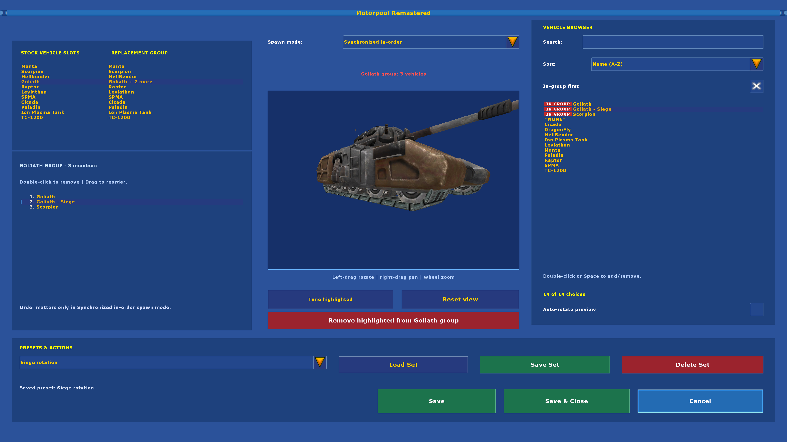
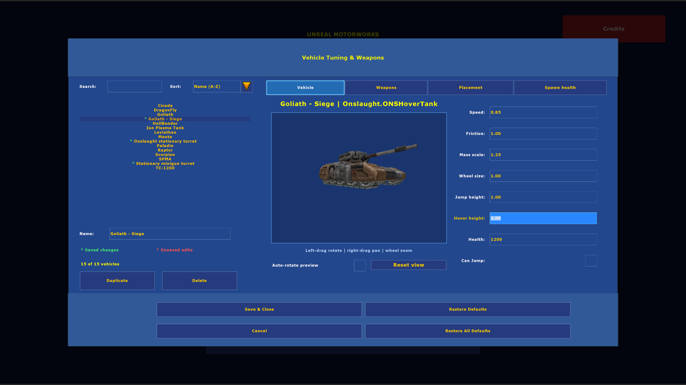
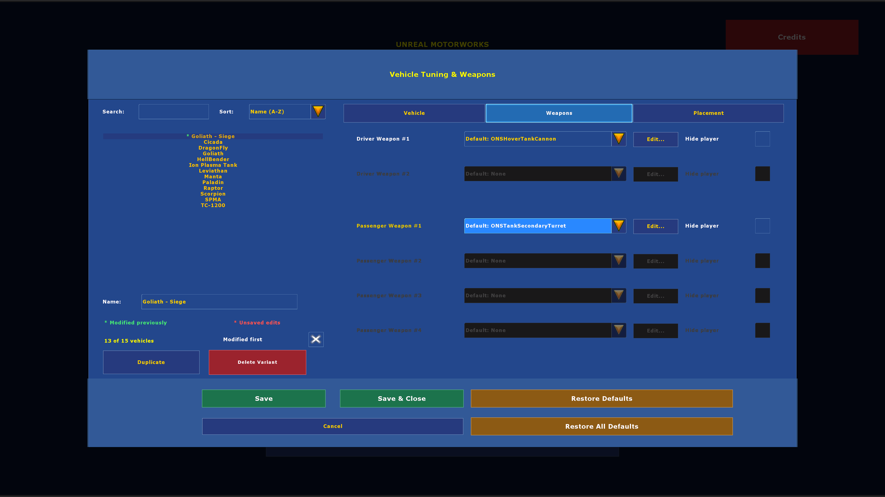
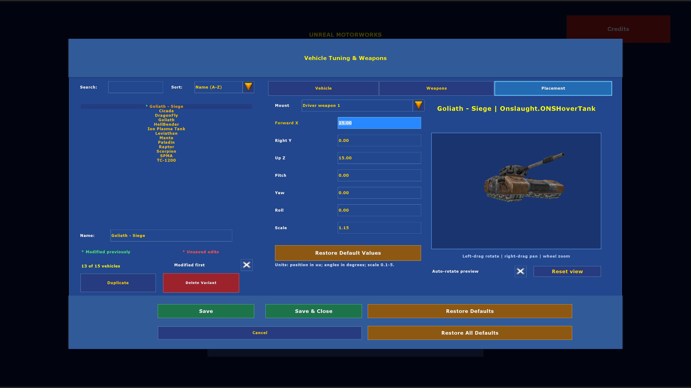

# Unreal Motorworks v0.3.0-beta.3 — Standalone Public Beta

By **Blue Natto (also known as CissiaLikesEggs on Gamebanana)**, for native OldUnreal Unreal Tournament 2004 **3374 or later**.

> **Public beta: bugs, rough edges, and compatibility issues are expected.** Back up your Motorworks settings before upgrading. Give it a spin and [tell me what breaks](https://github.com/NitrogenSulfide/unreal-motorworks/issues), including your OldUnreal version, map, mutators, and steps to reproduce. Compatibility with every custom vehicle and multiplayer setup is not guaranteed.

Choose vehicle replacement groups and tune vehicles through one mutator. Duplicate vehicles into independently named variants, change health and weapons, adjust weapon-mount position/rotation/scale, and optionally randomize spawn health. Unreal Motorworks includes its maintained tuning and replacement backends in one ZIP. Neither original VehicleStuff nor WoRM2k4 needs to be downloaded or installed.

**[Download the official public beta](https://github.com/NitrogenSulfide/unreal-motorworks/releases/latest)** · [Direct beta.3 ZIP](https://github.com/NitrogenSulfide/unreal-motorworks/releases/download/v0.3.0-beta.3/UnrealMotorworks-v0.3.0-beta.3.zip)

## Take a little motorpool tour (￣▽￣)ゞ

**[Watch the 2:30 showcase](https://www.youtube.com/watch?v=LJr4bDXzCrs)** — replacement groups, named variants, weapons, projectiles, placement, and synchronized spawn order.

Recorded during beta development; beta.3 simplifies Motorpool saving as described below. Custom vehicle packs and other mods shown are separate downloads.

## Install

1. Close UT2004. Use a native OldUnreal 3374+ installation; Steam/Proton installations have not been tested; support is not guaranteed.
2. **Fresh install:** extract `System/UnrealMotorworks.u` and `System/UnrealMotorworks.ucl` from the ZIP into your game's `System/` directory. The ZIP contains the complete mod; neither original mutator is required.
3. **Upgrading an earlier Motorworks beta:** back up your settings and migrate them before removing the old six Motorworks package files. Follow [the upgrade instructions](https://github.com/NitrogenSulfide/unreal-motorworks/blob/main/docs/UPGRADING.md); the ZIP includes an optional Python 3 migration helper that previews its changes and preserves exact backups. If you already use `UnrealMotorworks.ini` and the two unified package files, replace only those two package files.
4. Add **Unreal Motorworks: Motorpool + Tuning** to your mutators, then open its configuration. Enable only Motorworks. Old `VehicleSuite`, `VehicleStuffFix`, and `WoRM2k4Fix` packages must not remain beside the unified build.

The ZIP contains one compiled package, one mutator registration, this README, and the optional `upgrade-settings.py` helper. It includes no custom vehicles, voice packs, personal presets, or game binaries. Python is only needed for the optional upgrade helper; fresh installs need no helper or other mod download.

## Use

- **Motorpool Remastered**: choose replacements for each stock vehicle slot. Groups can contain several vehicle classes or differently tuned variants of the same class. Double-click a browser vehicle to add/remove it from the selected stock group; double-click a numbered group member to remove it. Single clicks preview/select, and Space still toggles browser membership.
- **Reset view**: restore the Motorpool preview's fitted zoom, centered position and default angle. Auto-rotate keeps your chosen setting.
- **Synchronized in-order**: drag members in the bottom-left group list to change the spawn sequence, then Save Set. Independent random groups keep normal selection behavior.
- **View / tune highlighted vehicle**: open the tuner at the selected entry.
- **Duplicate as variant**: create a persistent independent profile. Name it, change settings, and save. Delete is available only for duplicates.
- **Weapons and custom projectiles**: each mount starts with Default: [original weapon], followed by None and a divider before other guns. None removes the mount's gun. Selecting a different gun clears the previous gun's projectile overrides. Edit opens that gun's current projectile/interval draft, starting from its native defaults for a newly selected gun. Restore Defaults resets the draft to the selected gun's projectiles and intervals. Done applies edits; Cancel or Escape discards them. Reopening Edit for the same gun preserves its custom settings. Placement auto-rotate starts enabled and can be switched off.
- **Variants and previews**: duplicate names are numbered independently for each base vehicle. Motorpool previews use the selected profile’s saved weapon and placement settings. In-group first and Modified first start enabled.
- **Modification markers**: a green asterisk marks vehicles modified previously; a red asterisk marks changes made since opening the editor. Reverting to the opening values clears the red marker. Restore Defaults clears the marker immediately; use Save to commit the reset, or Cancel to discard it. The key sits below the Name field.
- **Placement**: Restore Default Values resets only the selected mount’s offsets, angles and scale, while preserving the preview camera. Preview driver/passenger weapon-mount position (Unreal units), rotation (degrees), and uniform scale. Integrated stationary-turret weapons retain their native mounts.
- **In-group first**: bring current group members to the top without changing Search or Sort.
- **Spawn health**: set minimum/maximum multipliers against configured health. A vehicle gets one roll when it spawns; live updates do not reroll it. Respawning stationary turrets get fresh tuning.
- **Tuning limits**: speed, friction and mass scale cap at 5; wheel size and jump height at 3; hover height at 2; fixed and random spawn health at 1,000,000 HP.
- **Stationary turrets**: excluded from the tuning browser for this beta. Motorpool handles vehicle factory slots.

Save commits changes without closing the editor; Save & Close commits and closes it. Cancel discards the current editor's unsaved changes. Motorpool’s Save Set saves and activates the named set; Load Set activates an existing set. Both apply on the next map. Close prompts with Save, Don't Save, and Cancel. Popup Save uses Unnamed01, Unnamed02, and so on when no valid set name is selected, skipping existing names. During a standalone match, `mutate VehicleSuite Config` opens the hub. Tuning saves apply immediately in standalone; Motorpool changes take effect on the next map.

Custom firing uses projectile behavior with the selected gun’s model and muzzle. It does not reproduce every gun’s special logic, targeting, or animations. If neither custom projectile is configured, the selected gun keeps normal firing. Custom projectile editing is available for supported Onslaught vehicle mounts; Assault vehicle weapon logic remains native.

This version consolidates all maintained classes into `UnrealMotorworks.u`. Settings now live in `UnrealMotorworks.ini`. Package identity has changed: upgrade both server and client together, and migrate earlier Motorworks settings before removing the old packages. The `mutate VehicleSuite Config` command remains available for compatibility.

## Presets, updates, and removal

Older profiles saved with the former “Custom” gun choice retain their projectiles and intervals, and migrate to custom firing with the stock gun as their starting selection. Those profiles did not record the gun selection they replaced; select a different gun again if desired.

`UnrealMotorworks.ini` is now authoritative. The upgrade helper copies only the four Motorworks sections from `VehicleStuffFix.ini`, `KangMods.ini`, and `VehicleSuite.ini`; it keeps those old files intact and leaves unrelated presets/settings alone. Existing unified sections take precedence, so rerunning migration does not replace your newer settings. Original-only WoRM2k4 presets are not automatically imported.

To uninstall, close UT2004 and remove only `UnrealMotorworks.u` and `UnrealMotorworks.ucl`. Keep the INI to retain your settings. For a fresh start, back up and remove `UnrealMotorworks.ini`. Original `VehicleStuff.u`, `WoRM2k4.u`, and shared `KangMods.ini` remain separate; preserve them if other installed mods use them. Do not mix this build with earlier Motorworks packages.

## Servers and beta scope

Both extra-client-package lists default to empty. A fresh install does not request the author's custom vehicles or voice packs. Server admins using custom vehicles can list their actual package names under `[UnrealMotorworks.MutVehicleSuite]` in `UnrealMotorworks.ini` using `VehicleServerPackages[0]=YourPackage`, and further indices up to 31. `VoiceServerPackages[0]=YourVoicePackage` is an optional explicit override. Only configure content the server actually installs and needs. Standalone play skips this registration.

This is a public beta, built on native Linux OldUnreal 3374. Beta.2 fixes missing weapon/body attachments in editor previews for supported custom vehicles; gameplay behavior is unchanged. Beta.2 passed 100 editor/save/reload checks at 2560×1440, 49 preview checks across 16 vehicle variants, and 60 standalone gameplay checks covering vehicle entry, driving, firing, and exit. The preview fix was also tested by me in the installed game. Beta.1 passed editor regressions at 1920×1080, 2560×1440, and 3840×2160; those resolution checks were not all repeated for beta.2. Beta.3 passed 32 Motorpool workflow and restart checks at each of 1080p and 4K; its final UI captures were inspected, its installation and rollback checks passed, and its installed package hashes were verified. New physical pointer/keyboard, gameplay, and multiplayer tests were not repeated for beta.3. Feature screenshots below show the beta.3 UI in original 4K captures with stock vehicles. Native Windows remains unvalidated.

**Limited multiplayer testing (beta.1):** one native OldUnreal dedicated server and one local client, with separate configurations. Joining, variant respawns, health, replacement weapons, and mount placement passed. Driving and firing were tested by me during beta development. Automated tests also exercised custom projectile firing and persistence. The dedicated server/client checks were not repeated for beta.2 or beta.3. These checks do not establish exhaustive multiplayer gameplay coverage. Internet play, multiple clients, listen servers, and package downloads remain unverified. Compatibility with every custom vehicle is not guaranteed.

**Standalone beta update:** the original mod downloads are no longer prerequisites. A fresh configuration now resolves directly to stock vehicle mappings. Custom vehicles remain optional separate downloads; this ZIP includes the editor and runtime, not a custom vehicle collection.

Report your OldUnreal patch version, map, mutators, reproduction steps, and relevant UT2004 log messages in [Issues](https://github.com/NitrogenSulfide/unreal-motorworks/issues).

## Credits

- Unreal Motorworks coordination, maintained backend fixes, and new editor work: **Blue Natto (also known as CissiaLikesEggs on Gamebanana)**.
- Original **VehicleStuff**, by **[-will-]** and the **Fraghouse Mod Team**; original testing: **Underscore**. [Preserved VehicleStuff listing](https://pwc.muffincdn.com/ut2004/?dir=mutators) and [historical official contest listing](https://zx.net.nz/mirror/www.unrealtournament.com/ut2003/ct_phase3/ct_mutator.html).
- Original **WoRM2k4 / Motorpool**, by **Kangus (Justin Follis)**; original thanks to WMP forum testers, Obscenery, and EvilDrWong. [Preserved original mod page](https://unrealarchive.org/unreal-tournament-2004/mutators/W/worm2k4-v2-5_7508a8b2.html).

These links credit the original work; they are not installation requirements. Motorworks is self-contained and does not bundle either original mod.

The Blue Natto avatar appears beside the centered author credit. The in-game Credits panel preserves the original-author attribution. If the legacy mod is already installed, its artwork may appear in Credits; this is optional and is not needed to use Motorworks.

## Feature screenshots

Original in-game 4K captures of **v0.3.0-beta.3**, using stock vehicles and an example tuning variant.

## Repository and validation

This separate repository contains the original coordination-layer source under `src/UnrealMotorworks`, public documentation, approved feature screenshots, and portable validation tools. The maintained backend forks are assembled into the single compiled package in Releases; their source and private build inputs are not included in this repository. This is not a complete reproducible source distribution. No blanket open-source licence is asserted for the upstream-derived backends; see [provenance and credits](docs/PROVENANCE.md).

[Validation](docs/VALIDATION.md) separates native tests, user testing, and portable CI. [Review process](docs/REVIEW_PROCESS.md) describes the release gates. GitHub Actions checks source boundaries, syntax, release metadata, temporary fixtures, and credentials; it does not build or launch UT2004 and does not publish releases automatically.

## Follow along & fuel the tinkering

Thanks for giving my little motorpool experiment a spin! If you build something delightfully silly, I'd love to see it (｡•̀ᴗ-)✧

- **Follow the tinkering:** [drop a star on GitHub](https://github.com/NitrogenSulfide/unreal-motorworks) if you like what I'm building, and watch the releases for new versions.
- **Found a gremlin?** [Send a bug report](https://github.com/NitrogenSulfide/unreal-motorworks/issues) so I can coax it out of the engine bay.
- **Coffee for the workshop:** [support Blue Natto on Ko-fi](https://ko-fi.com/bluenatto) if you'd like to fuel more late-night vehicle nonsense. Entirely optional — playing the mod and sharing feedback already helps plenty! (´꒳`)♡
